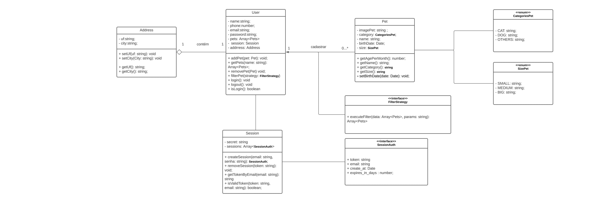

# AdotaJá 2.0 POO


Este documento tem como objetivo apresentar uma descrição dos requisitos do sistema AdotaJá, que tem como principal função juntar pessoas que querem doar/ONGs que precisam ter mais visibilidade, com pessoas que desejam ajudar esses animais dando um abrigo, comida e principalmente amor.
Dentre os objetivos deste documento estão o de listar da forma mais clara possível, os requisitos funcionais e não funcionais do sistema em questão.

## Funcionalidades

- Cadastro de usuário(nome, data de nascimento, número e email);
- Cadastro de animal(Foto do animal, categoria do animal, nome, idade e porte);
- Filtragem do animal(porte, categoria, idade);
- Login do usuário;

## Diagrama de Casos de uso


## Diagrama de Classes



## Instalação

Para instalação: 

```bash
  git clone myproject 
  cd myproject
  yarn install
```
    
## Rodando os testes

Para rodar os testes, rode o seguinte comando

```bash
  yarn test 
```

